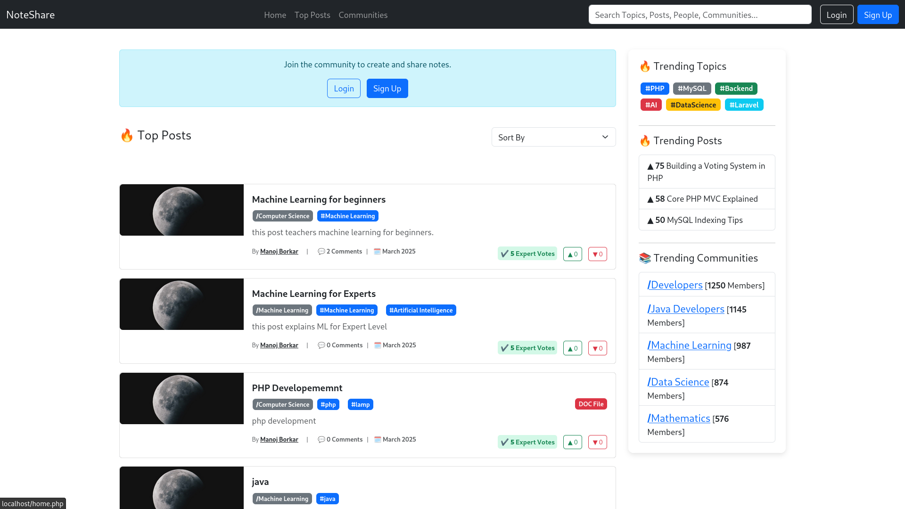
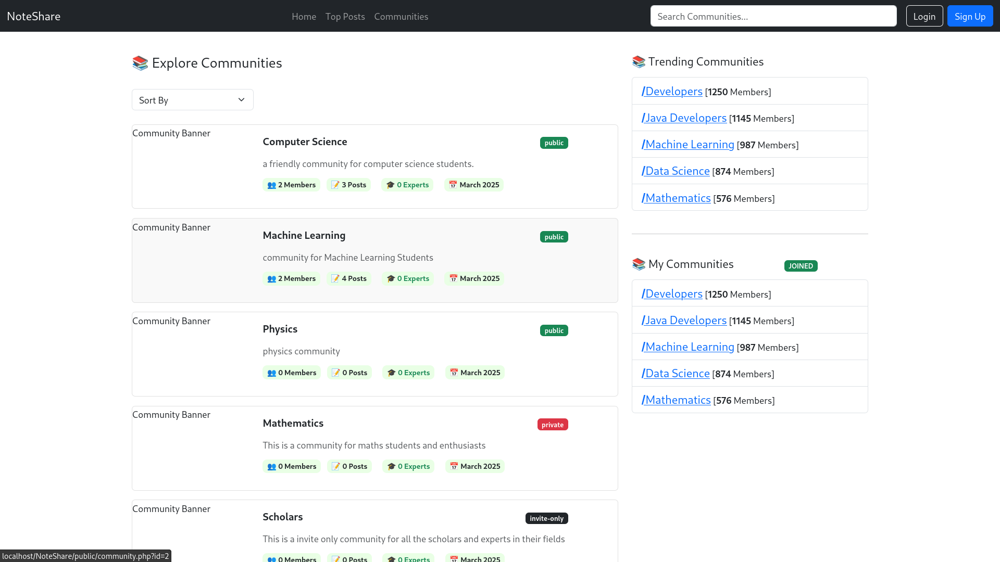
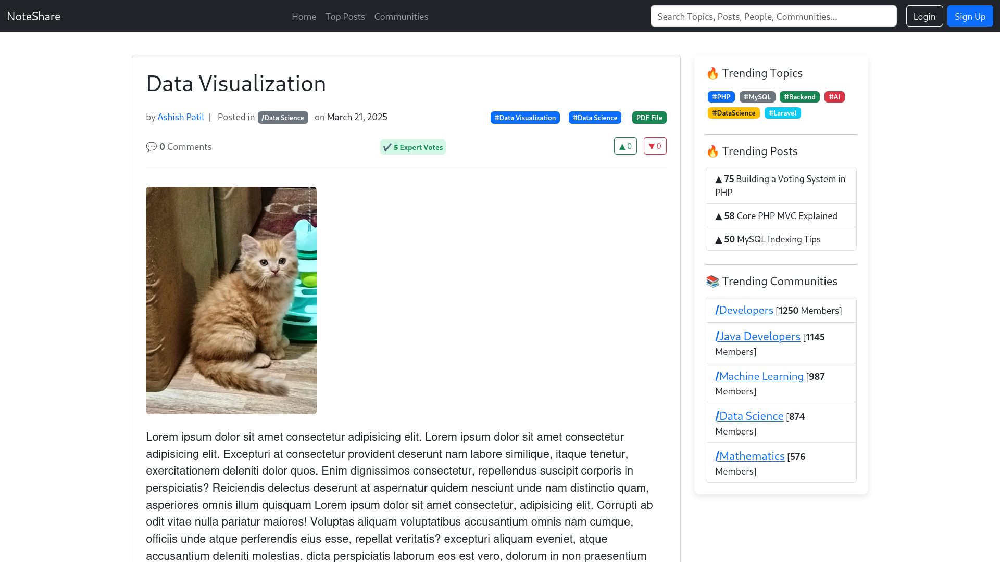
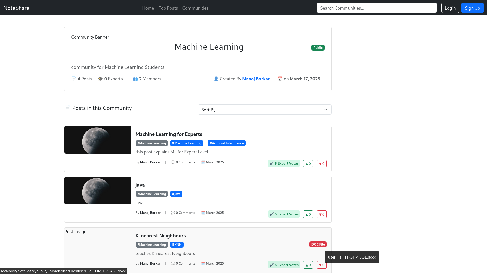

# 🎓 Expert-Student Discussion & Learning Platform

A dynamic web-based platform built with **PHP**, **MySQL**, and **Bootstrap**, enabling students, subject-matter experts, and knowledge seekers to **collaborate, connect, and share educational content**.

> 🔧 Currently under development. Core features implemented. Several advanced modules planned.

---

## 🚀 Features Implemented

- 📚 **Community-Based Architecture** (Inspired by Reddit’s Subreddits)
  
- 📌 **Trending Topics, Tags, and Communities**

- 👍👎 **Upvote/Downvote System** for Posts

- 🏷️ **Tag-Based Filtering & Categorization**

- 👥 **Friends & Follower System**

- 🧠 **Expert Validation** (Posts can be approved/disapproved by experts)

- 🔔 **Real-Time Toast Notifications**

- 🌙 **Dark Mode Support**

- 📊 **Admin Dashboard with Statistics (Chart.js Offline)**

- 📍 **Breadcrumb Navigation for Improved UX**

- 📂 **File Upload System (Post Attachments)**

---

## Snapshots

#### Home

***

#### Communities

***

#### Post (single)

***

#### Community (single)

***

## 🔭 Features Coming Soon (Work in Progress)

- 🧠 Expert Profiles with Reputation / Karma
- 💬 Comment Likes, Editing, Replies (Nested Comments)
- 📈 Personalized Feed (Posts from Friends, Followed Experts & Joined Communities)
- 📥 Save-for-Later Feature for Posts
- 🔍 AJAX-Powered Live Search & Sorting
- 📬 Notification Dropdown for Friend/Follow Requests
- 🧪 Modular MVC Structure Refactor
- 🎖 Gamification (Badges, Stats, Karma System)

---

## 💡 Inspiration

- **Reddit** – For community-based post organization  
- **Facebook** – For friend/follow interaction  
- **Stack Overflow** – For expert-validated responses  

This platform combines the **structure of Reddit**, the **connectivity of Facebook**, and the **credibility of Stack Overflow** — designed for academic collaboration.

---

## 🧰 Tech Stack

- **Frontend**: HTML5, CSS3, Bootstrap 5, JavaScript
- **Backend**: Core PHP, MySQL

- **Server**: Apache/2.4.58 (Unix)
- **OpenSSL**: 1.1.1w 
- **PHP**: 8.2.12 
- **Other Tools**: Chart.js (Offline), jQuery, AJAX
- **Environment**: XAMPP / LAMP Stack

---

## 🛠 Setup Instructions

1. Clone this repository
2. Import the SQL database from `/app/core/notes.sql`
3. Run the project on localhost using Apache (XAMPP or LAMP)

---

## 👨‍💻 Author

**Manoj (me)** — Developer, Problem Solver.

---

## ⚠️ Disclaimer

This is an academic project. Several features are under active development and may be incomplete or partially implemented.